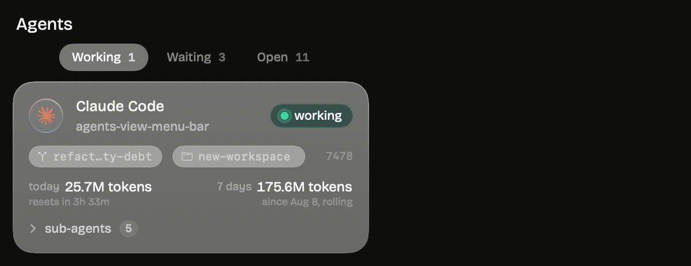

# agent-manager

A macOS menu bar app that answers two questions about your coding agents: which
ones are **actually working right now** and what each is doing, and how much
weekly quota is left before one of them stops mid-task.

Native Swift and SwiftUI, no Electron. Reads only local files, sends nothing
anywhere, and calls no undocumented vendor APIs.



## Why the rows differ

Agents are wildly inconsistent about what they write to disk, and the interface
is honest about that rather than inventing numbers:

| Agent | Running and activity | Tokens | Quota |
| --- | --- | --- | --- |
| Codex | yes | yes | **real limit**, straight from its own session log |
| Claude Code | yes, with the session title | yes | none published |
| OpenCode | yes, with the session title | yes, with spend | none published |
| Grok | yes | yes, with spend | none published |
| Cursor, Gemini, Antigravity, Hermes | yes | nothing on disk | none published |

A quota bar with a reset countdown only ever appears when the vendor genuinely
wrote a limit to disk. Everything else is labelled `usage`, meaning tokens
counted from local transcripts, which is what you spent rather than what you
have left. The two are never mixed. Agents that record nothing show presence
only; no number is invented to fill the column.

## Installing

Requires macOS 14 or later, and Command Line Tools for the build (no Xcode).

```sh
git clone https://github.com/NiladriHazra/agent-manager
cd agent-manager
./scripts/build.sh
open dist/agent-manager.app
```

The build is ad-hoc signed, so if you move the app somewhere Gatekeeper is
suspicious of, right-click it and choose Open the first time.

## Working, waiting, open

Three tabs, each backed by something actually written to disk.

**Working** — the agent wrote to its transcript in the last three minutes and
that transcript does not end on a finished turn.

**Waiting** — the last record *is* the end of a turn: `task_complete` for Codex,
`stop_reason: end_turn` for Claude. The agent has handed control back and the
next move is yours. Note that approval prompts are never written to a
transcript, so this means "finished its turn", which includes but is not limited
to a question waiting on screen.

**Open** — alive, but neither of the above.

The panel lists only agents that are actually working. A live process is not
the same as a working one: a session left open at a prompt stays alive for
hours, so activity is judged by how recently the agent wrote to its own
transcript. On the machine this was built against that was the difference
between "9 running" and the honest answer, 2. Idle sessions are counted
separately as open, and shown only if you ask for them.

Quota readings carry their age. A vendor only writes its limit while the agent
runs, so a number can be hours stale; when it is, the row says "as of 27m ago"
instead of pretending it is current.

## Settings

Open them from the dropdown footer:

- which agents appear, and whether to hide ones that are not installed
- what the menu bar shows: count and quota, count only, quota only, or icon only
- refresh interval
- amber and red thresholds for a low quota
- whether cache reads count toward usage totals (off by default, see below)
- launch at login

## How it stays cheap

An always-on menu bar app has no business burning CPU, and the data here is
large: 2.2 GB of Codex sessions and 500 MB of Claude transcripts on the machine
this was built against, including one single 295 MB session file.

- **Codex quota** is the final `token_count` record in the newest session, found
  by reading the last 64 KB and widening only if needed. Measured at 8 ms.
- **Claude usage** is an incremental index keyed by `(device, inode)`, so a
  refresh reads only the bytes appended since last time and skips untouched
  files without opening them. A cold build takes about a second; a warm refresh
  measured 30 ms.
- **OpenCode** totals are already aggregated per session in its SQLite database,
  so one read-only query covers the week.
- **Grok usage** comes from its per-turn `usage` records, tail-read per session.
- **Process detection** reads the kernel process table directly instead of
  forking `ps`, and takes about 6 ms. Matching is on the exec path plus the
  first two arguments, because the short name the kernel reports is useless:
  Claude runs from a version-named binary and reports `2.1.233`, `cursor-agent`
  is a shell script that execs node, and Hermes is `python3 .../bin/hermes`.

No code path can read an entire session file.

## Notes

- `agent-manager --diagnose` prints exactly what each provider read, with timings.
  Use it when a number looks wrong.
- Claude's cache-read tokens run around a hundred times larger than everything
  else, so they are excluded from the headline figure by default. The setting is
  there if you want them.
- The Codex quota is per account. If you use more than one, you see one of them.
- Logos are the vendors' own marks, in their real brand colours.
- The interface follows the Klipeo design system and uses macOS 26 Liquid Glass
  where the system provides it, falling back to a hand-built material below that.

## Licence

MIT.
